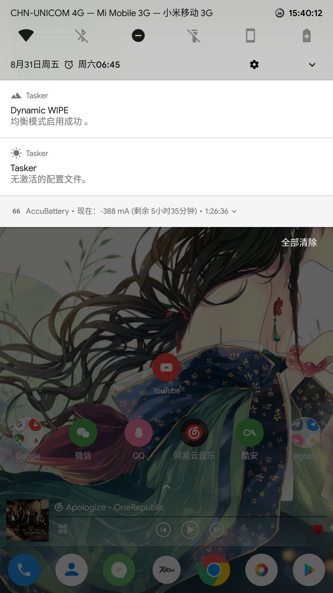

#  DynamicWIPE

A [Tasker](https://play.google.com/store/apps/details?id=net.dinglisch.android.taskerm) project in order to use [Project_WIPE](https://github.com/yc9559/cpufreq-interactive-opt) dynamically. Tasker实现自动化运行yc调度 (yc-WIPE_Tasker)

##  特性

- [x] **开机自启 → 均衡模式**
- [x] **打开屏幕 → 若3分钟（自定义）之内屏幕不被关闭，且当前未处于均衡模式，则启用均衡模式**
- [x] **关闭屏幕 → 若3分钟（自定义）之内屏幕不被打开，且当前未处于省电模式，则启用省电模式**
- [x] **运行游戏 → 打开游戏时立刻启用游戏模式；游戏切换至后台或退出/关闭屏幕（无论是否退出）超过3分钟（自定义），则启用均衡/省电模式；**
- [x] **自动配置 → 自主判断SOC平台并下载对应WIPE配置文件**
- [ ] 自动更新

##  原理

- 利用Tasker软件创建任务来实现动态运行Project WIPE 20180603.2

## 使用教程

- 设备已经取得ROOT权限
- 支持CPU调速器有Interactive模式的内核
- 检查/data目录下是否已有powercfg配置文件，若有请先删除
- 如果原本的温控过于激进，为了避免影响效果，需要删除原本的温控

1. 下载Tasker主程序
2. 打开Tasker，点右上角三个点，进入`首选项`
   - 在`界面`一栏取消勾选`初学者模式`（这样在Tasker主界面就有了`变量`一栏）
   - 在`监视器`一栏，修改`所有检查秒数`为3600，勾选`前端运行`（防止时间久了被安卓回收资源）
   - 在`杂项`一栏，勾选`减少资源消耗`
3. 下载 **DynamicWIPE.prj.xml**（复制以下链接到ADM等下载工具里下载）：

   -  原始版本：均衡+省电+游戏
   `https://raw.githubusercontent.com/sherlockwoo/DynamicWIPE/master/Tasker/DynamicWIPE.prj.xml`
   
   -  精简版本：~~均衡+~~省电+游戏
    `https://raw.githubusercontent.com/sherlockwoo/DynamicWIPE/master/Tasker/DynamicWIPE_lite.prj.xml`
   
4. 导入该项目文件：
   - 打开Tasker，长按左下角**房子**→ **导入**→找到并选择已下载的 **DynamicWIPE.prj.xml**文件
5. 进入任务栏，长按`☑ shØut`点击`Play`手动运行一次即可

##  注意

- 自动配置为实验性功能，如果完成上述教程步骤后发现Tasker提示不支持你的设备，但事实上设备的SOC确实在Project WIPE支持的SOC列表里时（详见文末），就得手动开启下载配置文件了：

1. 进入` ☑ AutomaticDL`
2. 长按选择 %ycURL，选择对应设备CPU平台的 %myURL，依次选择 下载配置文件step.1+2+3，点击左下角的▶下载配置文件
3. 最后再执行教程第5步即可

以835为例：

##  FAQ

1. 为什么通知栏总是显示Tasker无激活配置？

    > 该提示只是说明在当前状态下，没有配置处于激活状态。**并不影响DynamicWIPE的运行**。因为配置激活是在开机/开启/关闭屏幕的那一瞬间，如果此时你能看到下拉通知栏就会发现他是激活状态了。同理，当运行游戏时，你会看到`yc-3rd.performance`被激活

2. 游戏模式如何添加我想要的应用/游戏呢？
    > 在`配置文件`界面点击`yc-3rd.performance`以展开，再点击已有的应用/游戏进入应用列表添加，同时注意要打开无障碍功能

3. 软件需要后台吗？

    > 看情况。如果你需要动态调节特性，则需要；如果你全局只需要一种模式，则不需要

4. 如何才知道模式启动是否成功了？当前属于什么模式？

    > 内置三种提醒方式：通知栏提醒、弹出消息提醒、振动提醒；当前模式可在`变量`栏查看

5. 为什么不用Xposed edge pro？为什么不用微工具箱？为什么不用Kernel Auditor？为什么不用Magisk模块？

    > 萝卜青菜，各有所爱，仁者见仁，智者见智，让大家有多种选择

6. 调度相关问题请向原作者反馈，以下仅引述四种模式的区别（分别对应均衡模式、省电模式、游戏模式、极限模式）

    > - 均衡版，推荐使用这个，以往的DEV版本只提供这个档位，相对感知卡顿为85
    > - 卡顿版，带来更多的卡顿，如果硬是要节省一点电量，相对感知卡顿为115
    > - 费电版，可能比默认的更加费电，如果均衡的流畅度不能满意，相对感知卡顿为60
    > - 低延迟，相当的费电，如果需要稳定的性能调控例如专业多媒体，固定最低频率在1.6Ghz上下
    
7. DynamicWIPE.prj.xml和powercfg这两个文件有什么区别？

    > DynamicWIPE.prj.xml是Tasker的配置文件，powercfg是Project WIPE的配置文件

8. 运行配置后会报powercfg[249]的错误？

    > 请检查你的内核是否支持Interactive模式。某些内核如EAS内核的CPU调速器并没有Interactive模式，故执行任务会报错。通过刷入支持此模式的内核解决

9. 我遇到了提示其他错误，正确的提问方式是什么？

    > 简述你的操作步骤并提供变量栏中的myURL、ProfileStatus、WIPEStaus和Platform参数

10.说了这么多有什么用，我还是不知道怎样才算成功！能不能简单点！
 

##  卸载

- 删除Tasker配置文件和/data/powercfg 然后重启设备

##  感谢

[@yc9559](https://github.com/yc9559)

###  附：Project WIPE 支持的SOC列表

    > Snapdragon 835, 820/821, 810/808, 801/800/805, 660, 636, 652/650, 625/626
    > Exynos 8895, 8890, 7420
    > Kirin 970, 960, 950/955
    > Helio X20/X25, X10
    > Atom z3560/z3580
    > Snapdragon 845(非程序生成)

