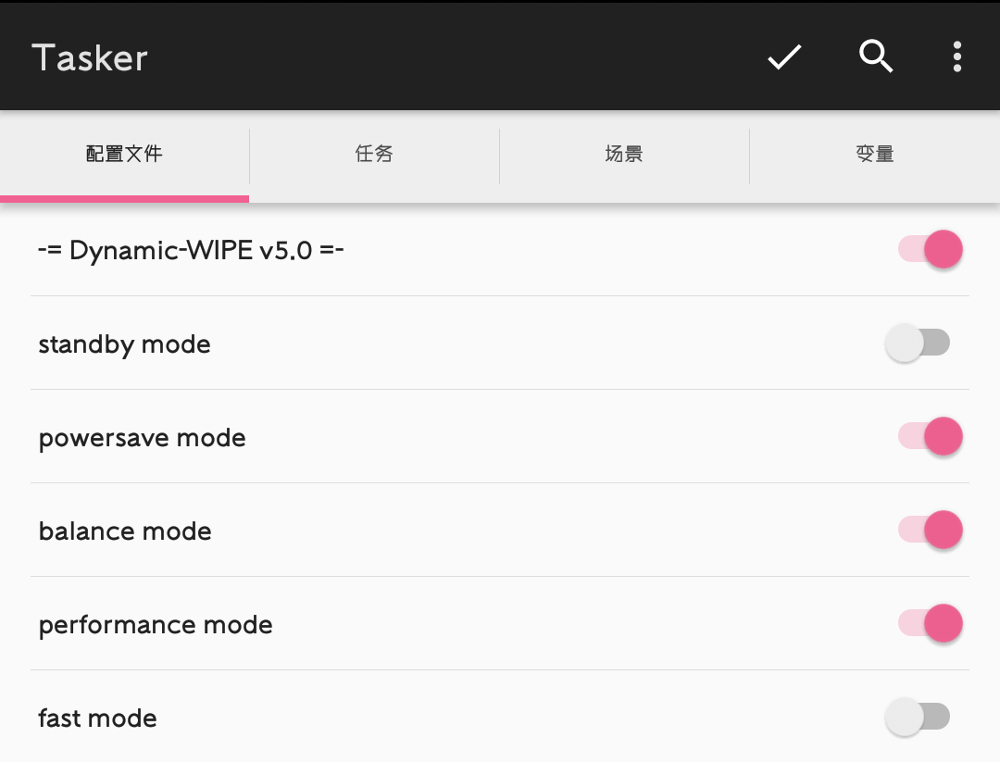
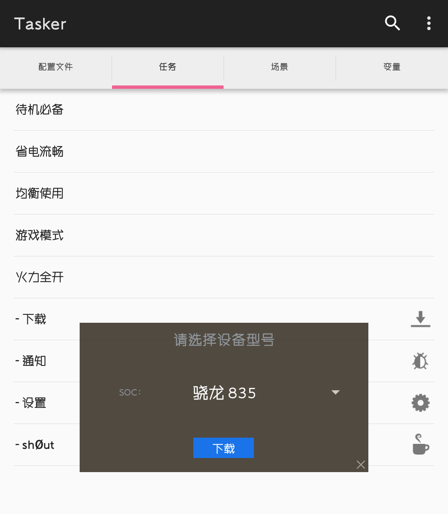
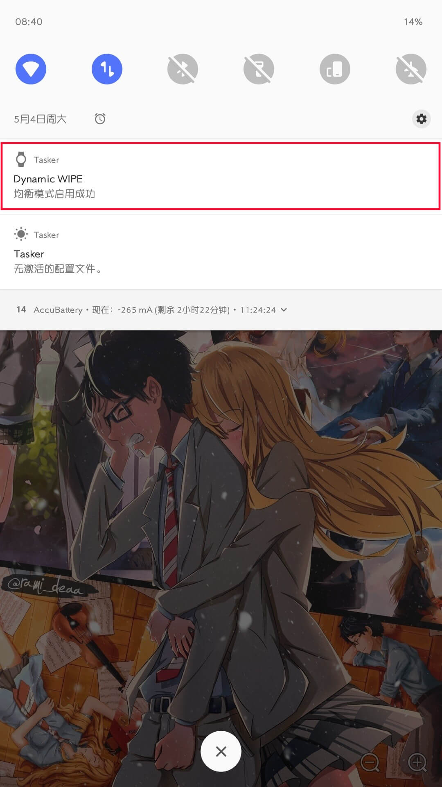

#  Dynamic WIPE

A [Tasker](https://play.google.com/store/apps/details?id=net.dinglisch.android.taskerm) project to use [Project WIPE v2](https://github.com/yc9559/wipe-v2) dynamically. 

利用 `Tasker` 实现自动化运行 `YC` 调度(Project WIPE v2), 从而使安卓设备达到节省电量等效果.

##  特性

- [x] **开机自启 → 均衡模式 注 [1]**
- [x] **打开屏幕 → 若 `3` 分钟(可自定义, 下同)之内屏幕不被关闭, 且当前未处于均衡模式, 则启用均衡模式.**
- [x] **关闭屏幕 → 若 `3` 分钟之内屏幕不被打开, 且当前未处于 `A` 模式 注 [2], 则启用 `A` 模式.**
- [x] **运行应用 → 打开应用时立刻启用 `B` 模式 注 [3]; 应用切换至后台或退出/关闭屏幕(无论是否退出应用)超过 `3` 分钟, 则启用均衡 / `A` 模式.**
- [x] **自动配置 → 自主判断 `SoC` 平台并下载对应 `WIPE v2` 配置文件.**
- [x] **手动设置 → 自行选择设备的 `SoC` 平台并下载对应 `WIPE v2` 配置文件.**
- [ ] 自动更新

>[1] 精简版只内置省电和性能两种模式. 开机自启及日常使用默认为省电模式, 运行指定应用立刻启用性能模式, 应用切换至后台或退出/关闭屏幕超过 `3` 分钟则返回省电模式.

>[2] `A` 模式为待机或省电模式, 在配置文件栏中 `standby mode` 和 `powersave mode` (默认)只能开启其中一个.

>[3] `B` 模式为性能或火力全开模式, 在配置文件栏中`performance mode` (默认)和 `fast mode` 只能开启其中一个.

##  原理

利用 `Tasker` 软件创建任务来实现动态运行 `Project WIPE v2`

## 使用教程

- 设备已经取得 `ROOT` 权限.
- 支持 `CPU` 调速器有 `Interactive` 模式的内核.
- 检查 `/data` 目录下是否已有 `powercfg` 配置文件, 若有请先删除.
- 如果原本的温控过于激进, 为了避免影响效果, 需要删除原本的温控.

1. 下载 [Tasker](https://www.lanzous.com/i40u34b) 主程序.
2. 打开 `Tasker`, 点右上角三个点, 进入**首选项**.
   - 在**界面**一栏取消勾选**初学者模式**(这样在 `Tasker` 主界面就有了**变量**一栏).
   - 在**监视器**一栏, 修改**所有检查秒数**为 `3600`, 勾选**前端运行**(防止时间久了被安卓回收资源).
   - 在**杂项**一栏, 勾选**减少资源消耗**.
3. 下载 `Dynamic_WIPE_xxx.zip` 压缩包.
4. 解压 `zip` 文件压缩包, 得到 `Dynamic_WIPE_xxx.prj.xml` 项目文件.
5. 导入项目文件: 
   打开 `Tasker`, 长按左下角**房子**→ **导入**→找到并选择已下载的 `Dynamic_WIPE_xxx.prj.xml` 项目文件.
6. 进入任务栏, 任选下列一种方式初始化文件: 
   - 自动配置 注 [4]
   长按 `- shØut` 点击 `Play` 就 `OK` 啦.
   - 手动设置 注 [5]
   长按`- 设置`点击 `Play` , 弹出对话框选择对应设备型号, 再点击下载按钮, 自动下载完成后会启用预设模式.

>[4] 骁龙 `821` 平台必须使用手动设置.

>[5] 自动配置为实验性功能, 如果使用自动配置后发现软件提示不支持你的设备, 但事实上设备的 `SoC` 确实在 `Project WIPE v2` 支持的 `SoC` 列表里时(详见文末), 可以尝试使用手动设置下载配置文件.

## 下载

三合一压缩包: [点此下载](https://github.com/Sherlockwoo/dynamic-wipe/raw/master/download/latest/dynamic-wipe.zip "悬停显示")

###  完整版

- 内置 **待机+均衡+省电+性能+极限** 模式

### 精简版

 - 内置 **省电+性能** 模式

### 855专版

- 内置 **均衡+省电+性能+极限** 模式

## 进阶玩法

- 设置磁贴

打开首选项- 动作- 快速设置中的任务
选择需要在下拉通知栏显示的某模式任务, 之后点击该磁贴即可快速开启某模式. 可选任务及对应的模式如下表: 

可选任务 | 完整版 | 精简版
:-: | :-: |  :-: 
游戏模式 | 性能 | -
火力全开 | 极限 | -
shØut | 均衡 | 省电
⚡️ 性能 | - | 性能

##  卸载

删除 `Tasker` 项目文件和 `/data/powercfg` 然后重启设备

##  FAQ

- 为什么通知栏总是显示 `Tasker` 无激活配置？如何关闭？

   该提示只是说明在当前状态下, 没有配置处于激活状态. **并不影响 `Dynamic WIPE` 的运行**. 因为配置激活是在开机/开启/关闭屏幕的那一瞬间, 如果此时你能看到下拉通知栏就会发现他是激活状态了.

   关闭方法:
   左划该通知至出现设置图标, 点击图标进入 `Tasker` 通知设置, 系统 `System` 通知找到监视器, 关闭!

- 游戏模式如何添加我想要的应用/游戏呢？

   在**配置文件**界面点击 `performance mode` 以展开, 再点击已有的应用/游戏进入应用列表添加, 同时注意要打开无障碍功能.

- 软件需要后台吗？

   看情况. 如果你需要动态调节特性, 则需要; 如果你全局只需要一种模式, 则不需要.

- 如何才知道模式启动是否成功了？当前属于什么模式？

   内置三种提醒方式: 通知栏提醒、弹出消息提醒、振动提醒; 当前模式可在**变量**栏查看

- 为什么不用 `Xposed edge pro`？为什么不用微工具箱？为什么不用 `Kernel Auditor`？为什么不用 `Magisk` 模块？

   萝卜青菜, 各有所爱; 仁者见仁, 智者见智. 让大家有多种选择.

- `Project WIPE v2` 内置的 `7` 种性能配置, 具体都有哪些？

level | 启动命令 | 相关解释
:-: | - | -
 0 | fast | 火力全开/低延迟
 1 | performance | 游戏模式/费电
 2 | level 2 | 新增
 3 | balance | 均衡使用/均衡
 4 | level 4 | 新增
 5 | powersave | 省电流畅/卡顿
 6 | level 6 | 待机必备/新增
    
- `Dynamic_WIPE_xxx.prj.xml` 和 `powercfg` 这两个文件有什么区别？

   `DynamicWIPE.prj.xml` 是 `Tasker` 的项目文件, `powercfg` 是 `Project WIPE v2` 的配置文件.

- 运行配置后会报 `powercfg[249]` 的错误？

   请检查你的内核是否支持 `Interactive` 模式. 某些内核如 `EAS` 内核的 `CPU` 调速器并没有 `Interactive` 模式, 故执行任务会报错. 通过刷入支持此模式的 `HMP` 内核解决.

- 我遇到了提示其他错误, 正确的提问方式是什么？

    简述你的操作步骤并提供软件变量栏中的完整截图. 

- 说了这么多有什么用, 我还是不知道怎样才算成功！能不能简单点！
 

## TO DO LIST

最新版tasker的通知

## 更新日志

### 20190628

1. 添加sdm855专版

### 20190504

1. 修复 手动设置不选择 SoC 下载会出错的问题

### 20190503

1. 同步更新wipe-v2
2. 手动下载设置支持图形化了
3. 新增 待机必备 模式(level 6)
4. 新增 精简版 (省电+游戏)
5. 加入了对 火力全开 (原极限模式)的支持
6. 填上了一些之前挖的坑, 变量栏更加简洁了
7. Enjoy it!

##  感谢

[@yc9559](https://github.com/yc9559)

##  附：Project WIPE v2 支持的 SoC 列表

- 2019.06.28
> Snapdragon 855

- 2019.05.03
> Snapdragon 835, 820, 821@2.0g, 821@2.1g, 821@2.3g, 660, 650/652/653, 636, 625
